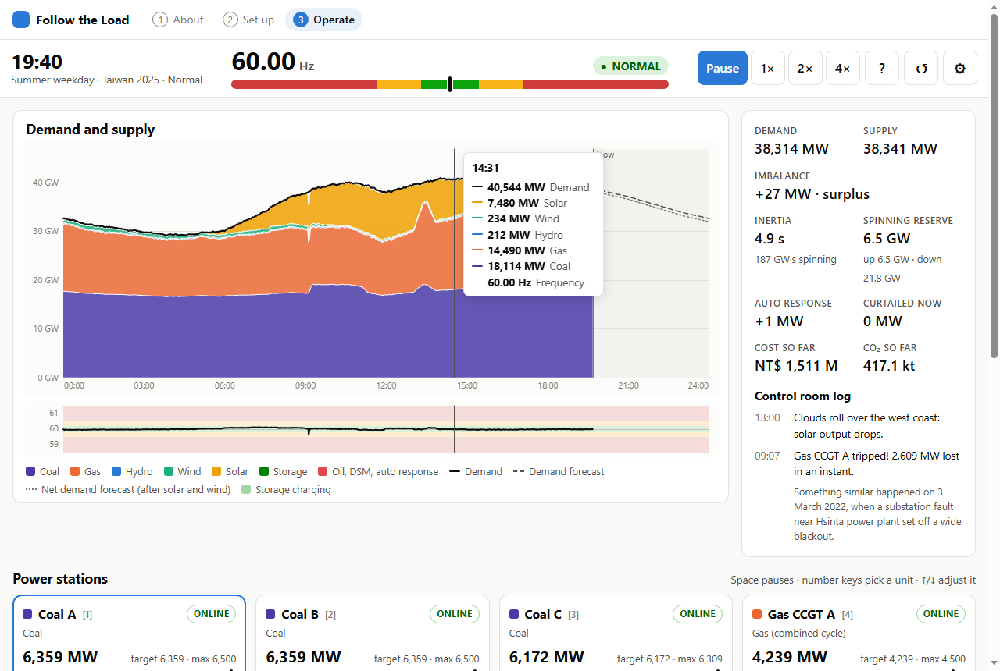
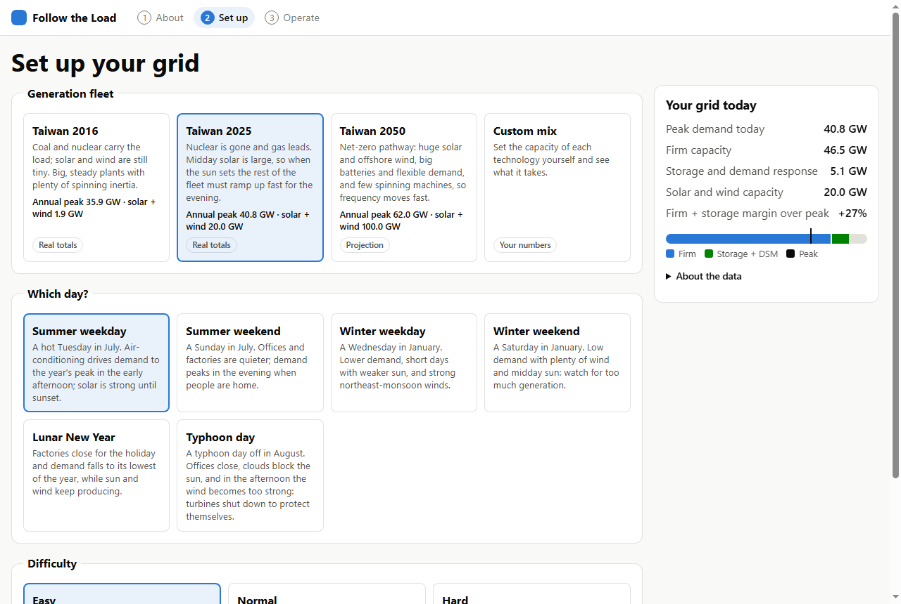
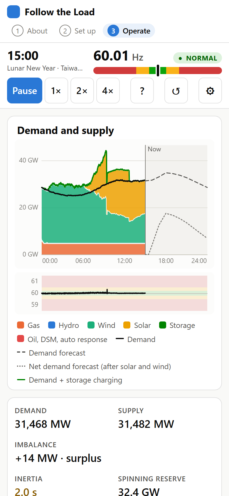

# 跟著負載走（Follow the Load）

[English](README.md) | **繁體中文**

一款免費的網頁遊戲：讓台灣這座孤島電網維持 60 Hz 一整天。

**▶ 開始玩：https://bartonchentw.github.io/grid-balancing-game/**

你是電網調度員。用電有高有低、太陽會下山、颱風讓風場停機，電廠還可能毫無預警地跳機。你要調度燃煤、燃氣、核能、水力、儲能、需量反應與再生能源，每種電源都有接近真實的起動時間與升降載速度，讓供電時時等於用電。

**核心觀念：** 電網穩定靠的是**彈性**，也就是跟著負載調整的能力。



## 怎麼玩

- **線上：** https://bartonchentw.github.io/grid-balancing-game/ （手機也能玩）。
- **在自己電腦上：** 需要 [Node.js](https://nodejs.org/) 20 以上版本（不必安裝任何套件）。

  ```sh
  npm start        # 在 http://localhost:8000 提供遊戲
  ```

  直接從資料夾開啟 `index.html` 無法執行：瀏覽器會封鎖 `file://` 頁面中的 ES 模組與資料檔。

在網址後面加上 `?demo`，可以觀看腳本調度員自動遊玩。

遊戲提供**英文與繁體中文**：會依瀏覽器語言顯示，也可用頁首的按鈕切換。頁首會顯示版本與發布日期；更新內容請見 [CHANGELOG.zh-TW.md](CHANGELOG.zh-TW.md)（[English](CHANGELOG.md)）。

### 遊戲流程

1. **認識遊戲：** 遊戲在講什麼、你的目標是什麼。
2. **設定電網：** 選擇電源組合（台灣 2016、2025、2050，或自訂組合）、選擇哪一天（夏季或冬季、平日或週末、農曆春節、颱風天）與難度。選項包括：意外事件（無、固定發生、隨機發生、兩者都有）、輔助，以及自動模式：儲能與需量反應、跟隨負載（核能、燃煤、燃氣）、水力／太陽光電／風力、尖峰機組備援，或「全部自動」。
3. **開始調度：** 跟著負載預測走。慢機組需要好幾小時才能起動；快速機組、儲能與需量反應負責應付起伏。讓頻率一直留在綠色區間，直到午夜。

設定畫面也會以**範圍**顯示電源組合的**整體系統成本**：建造這些電廠的資本支出，依各技術壽命以可調整的折現率（5–10%）均化為每年成本（新台幣／年）。建造成本、壽命與 ±30% 的不確定性取自[台灣 PyPSA-Earth 電力模型](https://bartonchentw.github.io/pypsa-earth/)（technology-data 2030 年推估）；計算方式見 [js/economics.js](js/economics.js)。

遊戲進行中，側邊面板會即時顯示碳排強度與燃料成本長條，並依燃料拆分，讓你看到多燒燃氣和燃油的代價。一天結束時，你會得到滿分 1,000 分的分數，由三項 KPI 組成：**供電可靠度**（頻率正常時間，扣除卸載；50%）、**成本**（每度電新台幣；25%）與**碳排**（每度電 CO₂ 克數；25%），另附關鍵數字與一句依當天情況給出的學習重點。

| 設定畫面 | 手機畫面 |
|---|---|
|  |  |

鍵盤：**空白鍵**暫停，**1–9、0** 選擇電源，**↑/↓** 調整出力，**←/→** 減少或增加一部運轉機組。在圖表上用 **←/→** 移動讀值。

## 模擬了什麼

所有遊戲規則都在 [js/sim.js](js/sim.js)、[js/units.js](js/units.js) 與 [js/auto.js](js/auto.js)，它們是不含瀏覽器程式碼的純函式，方便測試與重複使用。所有可調整的數字都在 [js/config.js](js/config.js) 與 [data/unit-types.json](data/unit-types.json)。

- **供需平衡與頻率。** 單一質量的搖擺方程式：`df/dt = f0 / (2·Ek) · 供需差 − D·(f − f0)`，其中 `Ek = Σ H·S` 是旋轉（同步）機組的動能。太陽光電、風力與電池不提供慣量，所以高再生能源電網的頻率變動更快。時間從「秒」壓縮成「遊戲分鐘」，讓你看得到變化。
- **機組群。** 每種電源是一張卡片，由多部相同的機組組成（例如 27 部約 700 MW 的燃煤機組）。你決定幾部**運轉中**、幾部**熱機備轉**、幾部**停機**，並一起調整所有運轉中機組的出力。機組狀態依序為 `停機 → 暖機 → 熱機備轉 → 起動中 → 運轉中 → 停機中`：冷機起動要好幾小時（燃煤 8 小時、燃氣複循環 2 小時、尖峰機組 15 分鐘），從熱機備轉快得多（燃煤 1 小時、複循環 30 分鐘、尖峰機組 5 分鐘），但維持熱機要花錢。機組有升降載速度限制與最低穩定出力；核能停機後當天無法再起動。水力有每日水量、儲能有電量與充放電損失（電池 90%、抽蓄水力 75%），需量反應有每日可抑低時間上限。太陽光電與風力依天氣發電，只能降載（棄電）。
- **自動反應。** 電池會自動對頻率做出反應，就像台電的電池調頻服務。可選的**輔助**會為所有可調度機組加上調速器反應。
- **自動模式**（每張卡片都有開關，預設值在設定畫面）。核能、燃煤與燃氣複循環機組在升降載限制內跟隨負載；水力在供電不足時補上並保留水量；儲能在電多時充電、電少時放電；燃氣尖峰機組與燃油機組在熱機備轉待命，供電不足時起動；需量反應最後才介入；太陽光電與風力只有在電力多到無處可用時才降載。要讓幾部火力機組運轉，仍由玩家決定。
- **保護機制。** 頻率低於 59.5 Hz 時，低頻電驛每段切離 5% 的負載；只有在備轉容量足夠時，調度員才會讓用戶復電。低於 58.5 Hz 或高於 61.5 Hz，電網全面停電。
- **意外事件。** **固定發生**的事件在固定時間出現：參考 2017 年大潭與 2022 年興達事件的機組跳機、雲層飄過，以及提前數小時預告的颱風風機停機。**隨機發生**的意外則在隨機時間出現：機組跳機、雲層、風力驟降與負載突增。

這些是為了教學而刻意的簡化：單一節點、沒有輸電限制、沒有電壓與虛功，常數以好玩為優先而非精確。程式碼註解會標出哪裡是近似。

## 排行榜

列入排名的遊戲（使用台灣電源組合、採用該難度預設選項）可以用暱稱送出分數。分數會立即顯示為「驗證中」，並由 GitHub Action（`tools/verify-scores.js`）使用當時的遊戲版本重播操作紀錄來驗證。後端是 [leaderboard/](leaderboard/) 中的小型 Cloudflare Worker 與 D1 資料庫；部署方式見 [leaderboard/DEPLOY.md](leaderboard/DEPLOY.md)。儲存內容：暱稱、分數、設定與操作紀錄；不收集電子郵件，也不保存 IP 位址。

## 資料來源

| 項目 | 狀態 | 來源 |
|---|---|---|
| 年度尖峰負載（2016、2025） | 官方 | 台電，歷年尖峰負載及備用容量率，[data.gov.tw/dataset/8307](https://data.gov.tw/dataset/8307) |
| 各類電源裝置容量（2016、2025） | 官方 | 能源署，發電裝置容量年資料，[data.gov.tw/dataset/16480](https://data.gov.tw/dataset/16480) |
| 電網儲能目標、用電成長 | 官方展望 | 經濟部，全國電力資源供需報告，[data.gov.tw/dataset/16437](https://data.gov.tw/dataset/16437) |
| 2050 年再生能源占比（60–70%） | 官方目標，待查證 | 國發會，臺灣2050淨零排放路徑，[ncsd.ndc.gov.tw](https://ncsd.ndc.gov.tw/Fore/nsdn/about0/2050Path) |
| 建造成本、壽命、成本不確定性 | 模型假設 | [台灣 PyPSA-Earth 電力模型](https://bartonchentw.github.io/pypsa-earth/)：technology-data 2030 年推估 |
| 每日負載曲線、太陽光電與風力曲線 | **示意資料** | 在 [tools/make-days.js](tools/make-days.js) 手繪，並依真實尖峰縮放 |
| 機組動態、燃料成本、儲能規模、2050 年電源組合 | **示意值** | 為了遊戲性而設定 |

年度數字整理自 [BartonChenTW/pypsa-earth（pypsa-taiwan-dev）](https://github.com/BartonChenTW/pypsa-earth/tree/pypsa-taiwan-dev) 的 `docs/data/taiwan_timeseries.csv`，其中記錄了每個數值的來源。[data/scenarios/](data/scenarios/) 中每個情境檔都有 `dataStatus`、`dataNotes` 與 `sources` 欄位，設定畫面的「關於資料」會顯示這些內容。

**徵求：** 典型日的台電 10 分鐘實測負載與太陽光電／風力曲線，用來取代示意的每日曲線。請見 [CONTRIBUTING.zh-TW.md](CONTRIBUTING.zh-TW.md)。

## 聯絡

作者：**Barton Chen**。

- 意見回饋、想法或問題回報：[開一個 issue](https://github.com/BartonChenTW/grid-balancing-game/issues/new/choose)（中文或英文皆可）。
- 電子郵件：[barton.chen.energy@gmail.com](mailto:barton.chen.energy@gmail.com)
- 相關專案：[台灣電力模型（PyPSA-Earth）](https://bartonchentw.github.io/pypsa-earth/)

## 開發

```sh
npm test                           # 85 項測試：機組、模擬、自動模式、資料、計分、成本
node tools/balance-report.js       # 腳本調度員玩過每個情境 × 每一天
node tools/balance-report.js hard  # …困難模式
node tools/make-days.js            # 重新產生 data/days.json
```

不需要建置步驟、沒有相依套件、沒有追蹤器。只用 HTML、CSS 與 JavaScript 模組。

```
index.html            三個畫面：認識遊戲、設定電網、開始調度
css/style.css         版面、淺色與深色主題、手機版面
js/main.js            載入資料、切換畫面
js/setup.js           第 2 步：電源組合、日期、難度、自訂組合、系統成本
js/play.js            第 3 步：遊戲迴圈、電源卡片、側邊面板、結束畫面
js/chart.js           負載與供電圖表、頻率條（canvas）
js/tutorial.js        第一次遊玩的提示
js/sim.js             模擬（純函式）
js/units.js           機組狀態機與限制（純函式）
js/fleet.js           卡片用的電源層級指令與摘要（純函式）
js/auto.js            自動模式（純函式）
js/economics.js       整體系統成本：均化資本成本範圍（純函式）
js/scenarios.js       資料載入、驗證、建立遊戲世界、自訂組合
js/score.js           三項 KPI 計分與學習重點
js/config.js          所有可調整的數字
js/strings.js         所有介面文字（英文）與語言切換
js/strings-zh-TW.js   繁體中文文字
js/version.js         頁首顯示的版本與發布日期
data/                 機組類型、日期類型、台灣情境
tools/                開發伺服器、日期產生器、自動調度員、平衡報告
tests/                node --test 測試
```

新增資料、翻譯或發布新版本，請見 [CONTRIBUTING.zh-TW.md](CONTRIBUTING.zh-TW.md)（[English](CONTRIBUTING.md)）。

## 授權

- 程式碼：[MIT](LICENSE)。
- `data/` 中的資料與遊戲文字：[CC BY 4.0](LICENSE-DATA.md)。官方原始資料依[政府資料開放授權條款第 1 版](https://data.gov.tw/license)釋出。
